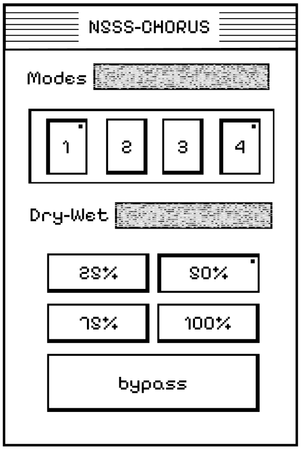

# N5SS-CHORUS

A free lofi dimension chorus plugin inspired by vintage analog pedals.



## About

N5SS-CHORUS emulates the warm, wobbly character of classic BBD (Bucket Brigade Device) chorus units. Perfect for adding depth and texture to lofi productions.

## Features

- **4 Dimension Modes** — Each mode simulates different vintage analog components
- **Combine up to 2 modes** — Layer modes for unique textures
- **5 Wet Levels** — 25%, 50%, 75%, 100%, or Bypass
- **Zero latency** — Real-time processing
- **Minimal CPU usage**

## Download

👉 **[Download latest release](../../releases/latest)**

Available formats:
- VST3 (macOS)
- AU (macOS)

## Installation

### macOS

**VST3:**
Copy `N5SS-CHORUS.vst3` to:
```
/Library/Audio/Plug-Ins/VST3/
```

**AU (Audio Unit):**
Copy `N5SS-CHORUS.component` to:
```
/Library/Audio/Plug-Ins/Components/
```

Then restart your DAW.

## Building from Source

### Requirements
- [JUCE](https://juce.com/) (v7.0+)
- Xcode (macOS)

### Steps
1. Clone this repo
2. Open `N5SS-CHORUS.jucer` in Projucer
3. Export to your IDE
4. Build

## License

MIT License — Free to use, modify, and distribute.

## Author

Made by **n5ssiva**

---

⭐ If you like this plugin, consider starring the repo!
